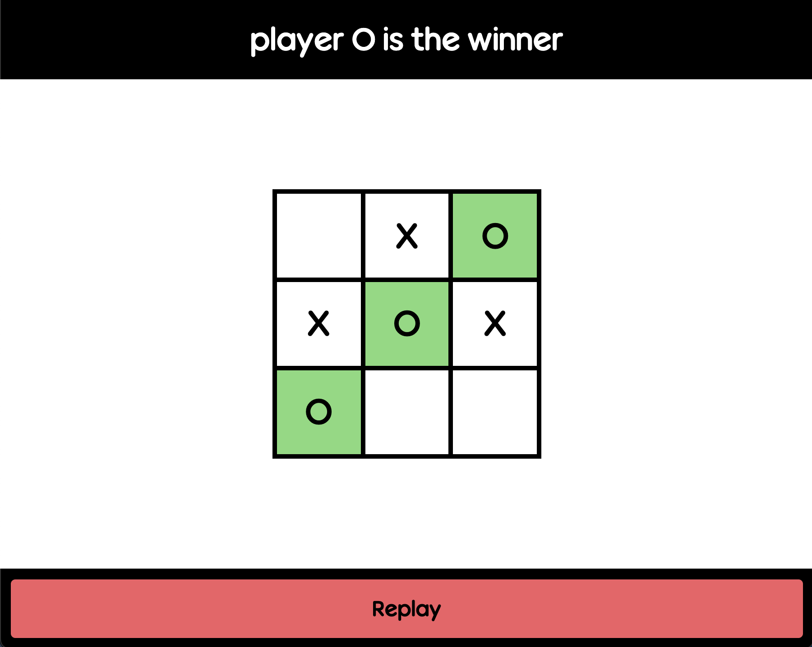
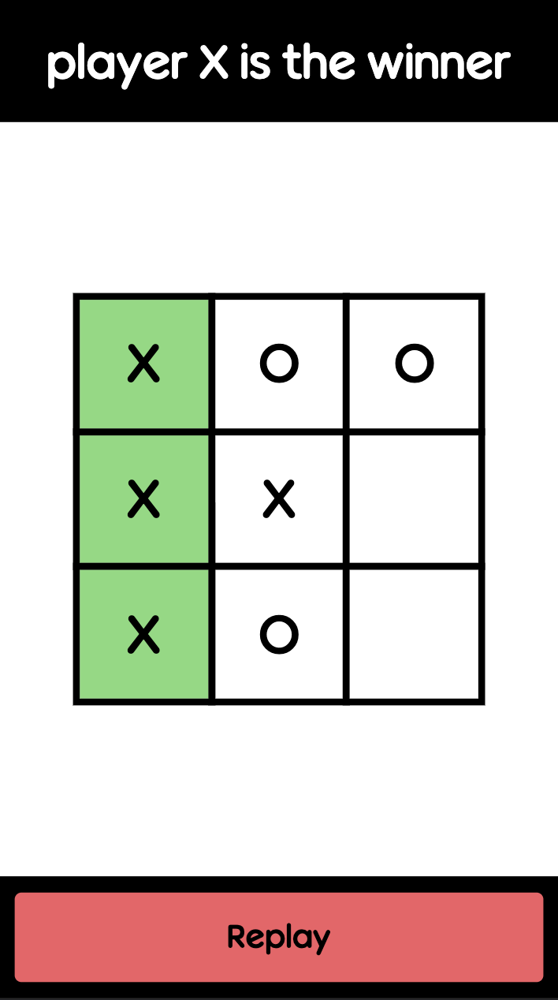

# Tic Tac To

A responsive Tic-Tac-Toe game, part of the Javascript curriculum in Full Stack Javascript.

## Things to note

* The board is made using CSS grid
* Global variables are avoided as much as possible. Factory functions and the module pattern is used.
  * Private variables and functions are stored in each module, and can only be used publicly if it is returned in the object literal.
  * In the `gameBoard` object, an array of 9 positions is stored privately, yet this scope is maintained through the public functions of gameBoard.
* Every time a player makes a turn, their positions are checked against each of the winning positions.
* When 9 moves are reached without a winner, there is a draw.

## Screenshots
Desktop             |  Mobile
:-------------------------:|:-------------------------:
  |  

## Demo

A live preview of the site can be found [here](https://tmprk.github.io/tic-tac-toe/)
